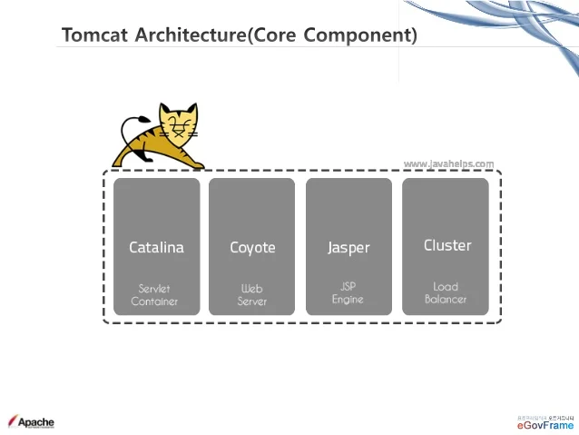

# Tìm hiểu về Tomcat

# 1. Giới thiệu về Tomcat

**Apache Tomcat** là một máy chủ web mã nguồn mở được phát triển bởi ***Apache Software Foundation (ASF)***. Nó là một trong những máy chủ ứng dụng web phổ biến nhất và được sử dụng để chạy các ứng dụng web Java

**Tomcat** thi hành các ứng dụng ***Java Servlet*** và ***JavaServer Pages (JSP)*** và cung cấp một máy chủ HTTP cho ngôn ngữ Java thuần túy để thực thi các chương trình lệnh viết bằng ngôn ngữ Java

## 1.1. Lịch sử phát triển của Tomcat

**Apache Tomcat** là một dự án con của Apache HTTP Server, máy chủ web phổ biến nhất thế giới. Một số sự kiện chú ý trong lịch sử phát triển Apache Tomcat:

- **Năm 1999**: Craig McClanahan, một nhân viên của Sun Microsystems, phát triển Tomcat dựa trên mã nguồn mở từ dự án Jakarta project của Apache Software Foundation
- **Năm 2000**: Phiên bản đầu tiên của Tomcat (Phiên bản 3.0) được phát hành, cho phép các ứng dụng web được phát triển bằng JSP (Java Server Pages) và Servlet
- **Năm 2002**: Apache Tomcat trở thành một dự án riêng biệt của Apache Software Foundation và được chính thức đổi tên thành Apache Tomcat
- **Năm 2004**: Phiên bản Tomcat 5.0 được phát hành hỗ trợ nhiều tính năng mới bao gồm JMX (Java Management Extensions), JSP 2.0 và Servlet 2.4
- **Năm 2006**:  Tomcat 6.0 được phát hành, cho phép các ứng dụng web sử dụng các phiên bản mới nhất của JSP và Servlet
- **Năm 2009**: Tomcat 7.0 được phát hành, hỗ trợ nhiều tính năng mưới bao gồm Web Socket, Servlet 3.0 và JSP 2.2
- **Năm 2013**: Tomcat 8.0 được phát hành, hỗ trợ nhiều tính năng mới như JASPIC (Java Authentication Service Provider Interface for Container), HTTP/2 và hỗ trợ Servlet 3.1
- **Năm 2016**: Phiên bản Tomcat 9.0 được phát hành, hỗ trợ nhiều cải tiến về bảo mật, hiệu suất và hỗ trợ JSP 2.3 và Servlet 4.0

Hiện nay đã có phiên bản Tomcat 10. và Tomcat 11. (Alpha)
## 1.2. Các cải tiến của mỗi phiên bản

### Apache Tomcat 5.x
- Hỗ trợ Java Servlet 2.4 và JSP 2.0
- Cải thiện về hiệu suất và độ ổn định so với các phiên bản trước đó
- Có tính năng mới để quản lý nhiều ứng dụng web trên cùng một máy chủ
### Apache Tomcat 6.x
- Hỗ trợ Java Servlet 2.5 và JSP 2.1
- Cải tiến về bảo mật và quản lý tài nguyên
- Cải tiến về quản lý phiên và các tính năng khác liên quan đến JavaServer Faces (JSF)
- Có thêm công cụ quản lý mới là Tomcat Manager để quản lý ứng dụng và máy chủ
### Apache Tomcat 7.x
- Hỗ trợ Java Servlet 3.0 và JSP 2.2
- Cải tiến về hiệu suất và bảo mật
- Có tính năng mới là WebSocket, cho phép kết nối hai chiều giữa máy chủ và máy khách
- Có công cụ quản lý mới là Tomcat WebSocket để quản lý kết nối WebSocket. 
### Apache Tomcat 8.x
- Hỗ trợ Java Servlet 3.1, JSP 2.3 và JavaServer Faces (JSF) 2.2
- Cải tiến về hiệu suất và bảo mật
- Có tính năng mới là NIO2, giúp cải thiện hiệu suất I/0 trên các ứng dụng web
- Có thêm công cụ quản lý mới là Tomcat JMX, cho phép quản lý máy chủ Tomcat thông qua giao diện JMX
### Apache Tomcat 9.x
- Hỗ trợ Java Servlet 4.0, JSP 2.3 và JavaServer Faces (JSF) 2.3
- Cải tiến hiệu suất và bảo mật
- Có tính năng mới là HTTP/2 và WebSocket 1.1, giúp cải thiện hiệu suất trên các ứng dụng web
- Có thêm công cụ quản lý mới là Tomcat JMX, cho phép quản lý máy chủ Tomcat thông qua giao diện JMX

## 1.3. Mục đích

Apache Tomcat là một máy chủ ứng dụng web mà nguồn mở được sử dụng để chạy các ứng dụng web Java. Tomcat được sử dụng chủ yếu để phục vụ các trang web động, các ứng dụng web và các dịch vụ web khác.

Mục đích chính của Apache Tomcat là cung cấp một môi trường chạy ứng dụng web Java an toàn, đáng tin cậy và hiệu quả. Nó cho phép người dùng triển khai các ứng dụng web Java của họ trên máy chủ web của mình và quản trị web dễ dàng

## 1.4 Ưu, nhược điểm

**Một số ưu điểm của Tomcat:**

- **Hỗ trợ Servlet và JSP**: Apache Tomcat cung cấp hỗ trợ cho java Servlet và JavaServer Pages (JSP), cho phép lập trình viên phát triển các ứng dụng web động và tương tác với cơ sở dữ liệu
- **Hỗ trợ các chuẩn web**: Apache Tomcat hỗ trợ nhiều chuẩn web phổ biến bao gồm HTTP, HTTPS, WebSockets, SSL và TLS.
- **Dễ dàng triển khai**: Tomcat có khả năng triển khai các ứng dụng web một cách dễ dàng và nhanh chóng qua các file WAR và JAR
- **Hỗ trợ nhiều nền tảng**: Tomcat có thể chạy trên nhiều nền tàng khác nhau bao gồm Windows hỗ trợ Server Manager, Linux và macOS
- **Quản lý ứng dụng**: Tomcat cung cấp các công cụ quản lý ứng dụng web, bao gồm cả giao diện quản lý web để quản lý các ứng dụng web trên máy chủ giúp cho việc quản lý ứng dụng web server được tốt hơn rất nhiều
- **Độ tin cậy cao**: Apache Tomcat được xây dựng với các tính năng độ tin cậy cao, bao gồm khả năng phục hồi sau sự cố và hỗ trợ cho khả năng mở rộng
- **Bảo mật**: Tomcat có nhiều tính năng bảo mật bao gồm hỗ trợ SSL và TLS, cơ chế kiểm soát truy cập và các tính năng bảo mật khác để bảo vệ ứng dụng web khỏi các cuộc tấn công

**Một số nhược điểm của Tomcat**

- **Tiêu thụ tài nguyên**: Tomcat có xu hướng tiêu thụ nhiều tài nguyên hệ thống, bao gồm bộ nhớ và CPU. Điều này có thể làm giảm hiệu suất của hệ thống khi có nhiều ứng dụng hoặc lưu lượng truy cập lớn
- **Hiệu suất trong quá trình khởi động**: Tomcat có thể mất thời gian để khởi động, đặc biệt là khi có nhiều ứng dụng và thành phần phải được tải và cấu hình
- **Hiệu suất xử lý tĩnh**: Tomcat chủ yếu được tối ưu hóa cho việc xử lý ứng dụng web  động và JSP, trong khi hiệu suất xử lý các tệp tĩnh như hình ảnh hoặc tài liệu HTML thuần túy có thể không được tối ưu tốt

Tuy nhiên, các nhược điểm này có thể được giảm thiểu hoặc vượt qua thông qua tối ưu hóa cấu hình, phân phối tải, sử dụng bộ nhớ cahe và sử dụng các  công cụ và kỹ thuật tối ưu hóa khác

## 1.5. Các thành phần trong máy chủ Apache Tomcat

**Catalina**: Là một thành phần chính trong Tomcat, là máy chủ Servlet và JSP. Nó đảm nhận vai trò chính trong việc xử lý các yêu cầu Servlet và JSP, quản lý vòng đời của các Servlet và JSP, và nó cung cấp môi trường chạy cho các ứng dụng web

**Coyote**: Là một công cụ kết nối (connector) được sử dụng trong Tomcat để xử lý giao tiếp mạng. Nó chịu trách nhiệm cho việc xử lý các yêu cầu HTTP và HTTPS đến Tomcat và chuyển chúng cho Catalina để xử lý

**Jasper**: Là trình biên dịch JSP (JavaServer Pages) của Tomcat. Nó chịu trách nhiệm biên dịch các trang JSP thành mã Servlet để thực thi trên Tomcat. Jasper sử dụng công nghệ tạo mã nguồn mở để biên dịch và quản lý các trang JSP

**Jasper Reports**: không phải là một thành phần trong Tomcat. Jasper Reports là một thư viện mã nguồn mở được sử dunggj để tạo ra và xuất báo cáo trong các ứng dụng Java. Nó cho phép bạn xây dựng các báo cáo động và ophong phú với nhiều định dạng đầu ra khác nhau như PDF, Excel, HTML, vv

# Tài liệu tham khảo

1. https://tomcat.apache.org/
2. https://vi.wikipedia.org/wiki/Apache_Tomcat
3. https://mdigi.vn/apache-tomcat-la-gi/
