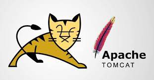

# Tìm hiểu về Tomcat

# 1. Giới thiệu về Tomcat

**Apache Tomcat** là một máy chủ web mã nguồn mở được phát triển bởi ***Apache Software Foundation (ASF)***. Nó là một trong những máy chủ ứng dụng web phổ biến nhất và được sử dụng để chạy các ứng dụng web Java

**Tomcat** thi hành các ứng dụng ***Java Servlet*** và ***JavaServer Pages (JSP)*** và cung cấp một máy chủ HTTP cho ngôn ngữ Java thuần túy để thực thi các chương trình lệnh viết bằng ngôn ngữ Java

## 1.1. Lịch sử phát triển của Tomcat

**Apache Tomcat** là một dự án con của Apache HTTP Server, máy chủ web phổ biến nhất thế giới. Một số sự kiện chú ý trong lịch sử phát triển Apache Tomcat:

- **Năm 1999**: Craig McClanahan, một nhân viên của Sun Microsystems, phát triển Tomcat dựa trên mã nguồn mở từ dự án Jakarta project của Apache Software Foundation
- **Năm 2000**: Phiên bản đầu tiên của Tomcat (Phiên bản 3.0) được phát hành, cho phép các ứng dụng web được phát triển bằng JSP (Java Server Pages) và Servlet
- **Năm 2002**: Apache Tomcat trở thành một dự án riêng biệt của Apache Software Foundation và được chính thức đổi tên thành Apache Tomcat
- **Năm 2004**: Phiên bản Tomcat 5.0 được phát hành hỗ trợ nhiều tính năng mới bao gồm JMX (Java Management Extensions), JSP 2.0 và Servlet 2.4
- **Năm 2006**:  Tomcat 6.0 được phát hành, cho phép các ứng dụng web sử dụng các phiên bản mới nhất của JSP và Servlet
- **Năm 2009**: Tomcat 7.0 được phát hành, hỗ trợ nhiều tính năng mưới bao gồm Web Socket, Servlet 3.0 và JSP 2.2
- **Năm 2013**: Tomcat 8.0 được phát hành, hỗ trợ nhiều tính năng mới như JASPIC (Java Authentication Service Provider Interface for Container), HTTP/2 và hỗ trợ Servlet 3.1
- **Năm 2016**: Phiên bản Tomcat 9.0 được phát hành, hỗ trợ nhiều cải tiến về bảo mật, hiệu suất và hỗ trợ JSP 2.3 và Servlet 4.0

Hiện nay đã có phiên bản Tomcat 10. và Tomcat 11. (Alpha)

## 1.2. Mục đích

Apache Tomcat là một máy chủ ứng dụng web mà nguồn mở được sử dụng để chạy các ứng dụng web Java. Tomcat được sử dụng chủ yếu để phục vụ các trang web động, các ứng dụng web và các dịch vụ web khác.

Mục đích chính của Apache Tomcat là cung cấp một môi trường chạy ứng dụng web Java an toàn, đáng tin cậy và hiệu quả. Nó cho phép người dùng triển khai các ứng dụng web Java của họ trên máy chủ web của mình và quản trị web dễ dàng

## 1.3 Ưu, nhược điểm

**Một số ưu điểm của Tomcat:**

- **Hỗ trợ Servlet và JSP**: Apache Tomcat cung cấp hỗ trợ cho java Servlet và JavaServer Pages (JSP), cho phép lập trình viên phát triển các ứng dụng web động và tương tác với cơ sở dữ liệu
- **Hỗ trợ các chuẩn web**: Apache Tomcat hỗ trợ nhiều chuẩn web phổ biến bao gồm HTTP, HTTPS, WebSockets, SSL và TLS.
- **Dễ dàng triển khai**: Tomcat có khả năng triển khai các ứng dụng web một cách dễ dàng và nhanh chóng qua các file WAR và JAR
- **Hỗ trợ nhiều nền tảng**: Tomcat có thể chạy trên nhiều nền tàng khác nhau bao gồm Windows hỗ trợ Server Manager, Linux và macOS
- **Quản lý ứng dụng**: Tomcat cung cấp các công cụ quản lý ứng dụng web, bao gồm cả giao diện quản lý web để quản lý các ứng dụng web trên máy chủ giúp cho việc quản lý ứng dụng web server được tốt hơn rất nhiều
- **Độ tin cậy cao**: Apache Tomcat được xây dựng với các tính năng độ tin cậy cao, bao gồm khả năng phục hồi sau sự cố và hỗ trợ cho khả năng mở rộng
- **Bảo mật**: Tomcat có nhiều tính năng bảo mật bao gồm hỗ trợ SSL và TLS, cơ chế kiểm soát truy cập và các tính năng bảo mật khác để bảo vệ ứng dụng web khỏi các cuộc tấn công

# Tài liệu tham khảo

1. https://tomcat.apache.org/
2. https://vi.wikipedia.org/wiki/Apache_Tomcat
3. https://mdigi.vn/apache-tomcat-la-gi/
