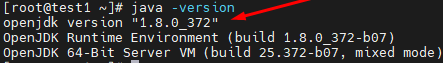
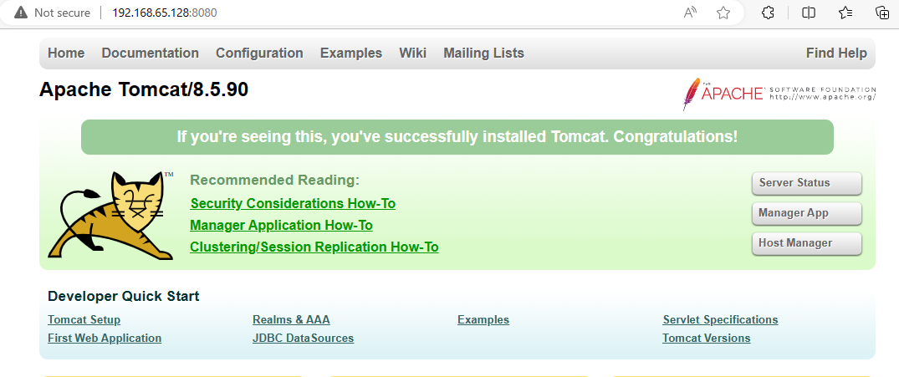

# Cách cài đặt Apache Tomcat trên CentOS 7 

- Java version 1.8.0
- Tomcat 8.5.90
- Tất cả đều dùng quyền root
# Các bước cài đặt

1. Cài đặt Java trên VM

```sh
yum install java-1.8.0-openjdk.x86_64
```

2. Kiểm tra phiên bản Java hiện tại

```sh
java -version
```



3. Tạo **user**  chuyên dụng cho Tomcat (Vì mục đích bảo mật, cần tạo một user không phải root, được đặt tên là "tomcat" và group "tomcat")

```sh
group add tomcat
mkdir /opt/tomcat
useradd -s /bin/nologin -g tomcat -d /opt/tomcat tomcat
#-s /bin/nologin: Thiết lập shell cho người dùng mới là /bin/nologin. Shell này không cho phép người dùng đăng nhập tương tác vào hệ thống
#-g tomcat: Thiết lập nhóm chính cho người dùng mới là nhóm "tomcat"
#-d /opt/tomcat: Thiết lập thư mục home cho người dùng mới là "/opt/tomcat". Đây là nơi mà người dùng "tomcat" sẽ được đặt khi đăng nhập
#tomcat: Tên người dùng mới sẽ được tạo
```
4. Tải xuống Tomcat từ nguồn chính thức [Apache Tomcat](https://tomcat.apache.org/)

```sh
wget https://dlcdn.apache.org/tomcat/tomcat-8/v8.5.90/bin/apache-tomcat-8.5.90.tar.gz
``` 
5. Giải nén file Tomcat vừa tải xuống
```sh
tar -zxvf apache-tomcat-8.5.90.tar.gz -C /opt/tomcat --strip-components=1
#-C /opt/tomcat: Chỉ định đường dẫn đích cho việc giải nén.
#--strip-components=1: Đây là tùy chọn để bỏ qua các thư mục cha trong tệp tin nén.
```

6. Thiết lập dịch vụ Tomcat trong Systemd

Để thuận tiện cho việc quản lý và kiểm tra, bạn cần thiết lập dịch vụ cho tomcat tại systemd

```sh
vim /etc/systemd/system/tomcat.service
```
```sh
[Unit]
Description=Apache Tomcat Web Application Container
After=syslog.target network.target

[Service]
Type=forking

Environment=JAVA_HOME=/usr/lin/jvm/jre-1.8.0
Environment=CATALINA_PID=/opt/tomcat/temp/tomcat.pid
Environment=CATALINA_HOME=/opt/tomcat
Environment=_CATALINA_BASE=/opt/tomcat
#Environment='CATALINA_OPTS=-Xms512M -Xmx1024M -server -XX:+UseParallelGC'
Environment='JAVA_OPTS=-Djava.awt.headless=true -Djava.security.egd=file:/dev.urandom'

ExecStart=/opt/tomcat/bin/startup.sh
ExecStop=/bin/kill -15 $MAINPID

User=tomcat
Group=tomcat

[Install]
WantedBy=multi-user.target
```

7. Tải lại daemon-reload

```sh
systemctl daemon-reload
```

8. Thay đổi quyền truy cập tệp cho thư mục ***/opt/tomcat***

```sh
chmod -R 777 /opt/tomcat
```

9. Khởi động dịch vụ Tomcat và Enable 

```sh
systemctl start tomcat.service
systemctl enable tomcat.service
```

Kiểm tra trạng thái tomcat

```sh
systemctl status tomcat.service
```

Cho phép qua firewalld hoặc tắt firewalld

10. Tắt dịch vụ Tomcat

```sh
kill PID
```



# Tài liệu tham khảo

[Install Tomcat](https://gist.github.com/swarupdonepudi/a899aff32f6098fab7c42cd97e6a58f8)