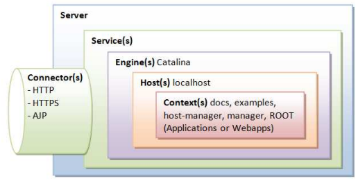

# Kiến trúc hoạt động

**Tomcat** là một máy chủ HTTP. Tomcat cũng là một bộ chứa servlet có thể thực thi Java Servlet và chuyển đổi JavaServer Pages (JSP) và JavaServer Faces (JSF) thành Java Servlet. Tomcat sử dụng một kiến trúc phân cấp và mô-đun như được hiển thị bên dưới.

Dưới đây là mô tả chi tiết về các lớp và phần tử trong kiến trúc của Tomcat:

1. ***Server***: Lớp Server đại diện cho một máy chủ Tomcat. Một máy chủ Tomcat có thể chứa nhiều dịch vụ (Service). Lớp Server chịu trách nhiệm quản lý các dịch vụ và khởi động/chấm dứt chúng.

2. ***Service***: Lớp Service đại diện cho một dịch vụ Tomcat. Một dịch vụ Tomcat bao gồm một hoặc nhiều Engine. Lớp Service chịu trách nhiệm quản lý các Engine và khởi động/chấm dứt chúng.

3. ***Engine***: Lớp Engine đại diện cho một "động cơ" trong Tomcat, có nhiệm vụ xử lý các yêu cầu và phản hồi từ các khách hàng. Một Engine có thể chứa nhiều Host.

4. ***Host***: Lớp Host đại diện cho một "máy chủ" ảo (virtual host) trong Tomcat. Một Host đại diện cho một tên miền hoặc một địa chỉ IP cụ thể. Mỗi Host có thể chứa nhiều Context.

5. ***Context***: Lớp Context đại diện cho một "bối cảnh" (context) trong Tomcat. Một Context đại diện cho một ứng dụng web cụ thể trong Tomcat, được liên kết với một đường dẫn cụ thể trên máy chủ. Mỗi ứng dụng web sẽ có một Context tương ứng.

6. ***Connector***: Connector là một phần riêng biệt trong kiến trúc của Tomcat và đảm nhận việc xử lý các kết nối mạng đến và từ Tomcat. Connector cho phép Tomcat giao tiếp với các máy khách thông qua các giao thức như HTTP, HTTPS, AJP, vv.

Tổ chức của các lớp và phần tử trong kiến trúc Tomcat như trong hình ảnh mô tả một sự phân cấp và tương tác giữa các thành phần. Điều này cho phép Tomcat quản lý các ứng dụng web và xử lý các yêu cầu từ máy khách một cách hiệu quả.
