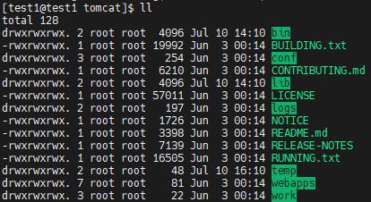
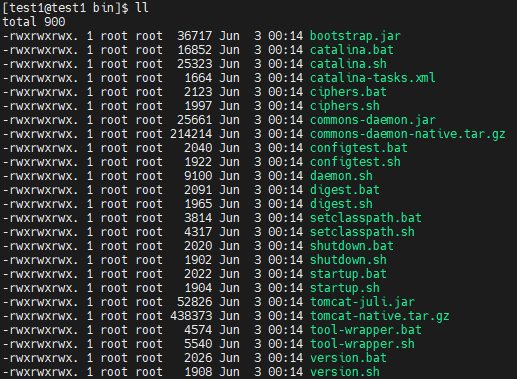
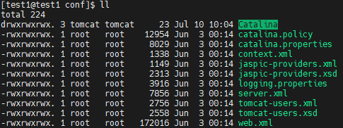
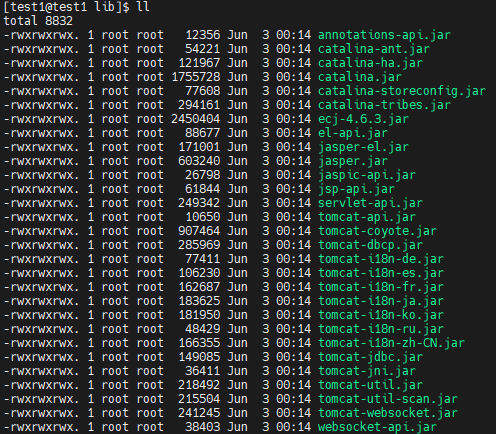
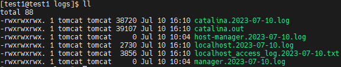
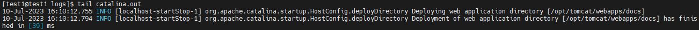

# Cấu trúc Thư mục trong Tomcat Apache

Cấu trúc thư mục trong Tomcat thường được tổ chức theo các thành phần và chức năng khác nhau của máy chủ ứng dụng web. Dưới đây là một mô tả cơ bản về cấu trúc thư mục chính trong Tomcat

## bin/

- Chứa các tệp thực thi và các tệp kịch bản liên quan đến việc quản lý và điều khiển Tomcat, bao gồm các tệp như `startup.sh`, `shutdown.sh`,`catalina.sh` và các tệp tương tự
- Các tệp `*.sh` (đối với hệ thống Unix và Mac OS) là bản sao chức năng của tệp `*.bat` (đối với hệ thống Windows)

## conf/

- Chứa các tệp cấu hình Tomcat trên toàn máy chủ
- Sửa đổi `server.xml` và `tomcat-users.xml` để điều chỉnh việc ghi nhật ký, xác thực và kiểm soát truy cập, bật TLS/SSL,...
- Các ứng dụng web có thể ghi đè một số cài đặt trên toàn may chủ trong tệp cấu hình riêng của chúng
- ***catalina.properties***: Đây là tệp cấu hình chính của Tomcat. Nó chứa các cài đặt liên quan đến các thuộc tính chung của máy chủ Tomcat, chẳng hạn như cổng kết nối, thời gian chờ, đường dẫn thư mục và các cài đặt khác
- ***server.xml***: Đây là tệp cấu hình máy chủ Tomcat. Nó xác định cấu hình của các thành phần chính như các cổng kết nối, ngữ cảnh ứng dụng, máy chủ ảo, SSL và nhiều hơn nữa. Ta có thể chỉnh sửa tệp này để tùy chỉnh cấu hình máy chủ Tomcat theo nhu cầu của cá nhân
- ***web.xml***: Đây là tệp cấu hình ứng dụng web mặc định. Nó chứa các cài đặt liên quan đến Servlet, Filter, Listener và các thành phần phần khác của ứng dụng web. Ta có thể sử dụng tệp này để định nghĩa các cấu hình ứng dụng Web cụ thể
- ***context.xml***: Đây là tệp cấu hình ngữ cảnh ứng dụng. Nó cho phép tùy chỉnh cấu hình cho mỗi ngữ cảnh ứng dụng riêng biệt trong Tomcat. Ta có thể định nghĩa các tài nguyên, tham số môi trường, ngữ cảnh JNDI (Java Naming and Directory Interface)  và các cài đặt khác cho mỗi ứng dụng web
- ***tomcat-users.xml***: Đây là tệp cấu hình của người dùng và vai trò trong Tomcat. Ta có thể định nghĩa người dùng và vai trò, cũng như liên kết vai trò với người dùng trong tệp này. Tệp này được sử dụng để quản lý quyền truy cập và xác thực người dùng cho các ứng dụng web
- ***logging.properties***: Đây là tệp cấu hình cho hệ thống ghi nhật ký (logging) của Tomcat. Nó xác định cách ghi lại các sự kiện và thông tin liên quan đến hoạt động của Tomcat. Ta có thể định nghĩa cấu hình ghi nhật ký cụ thể cho từng cấp độ và loại thông báo 
- Các tệp cấu hình khác như ***catalina.policy***, ***jaspic-providers.xml***, ***jaspic-providers.xsd***, ***tomcat-user.xsd*** cung cấp cấu hình và quy định cho các tính năng và tiêu chuẩn khác trong Tomcat, như cung cấp quyền truy cập và xác thực, cấu hình JASPIC (Java Authentication Service Provider Interface for Containers) và các tiêu chuẩn XML

## lib/

Chứa các thư viện và gói thư viện (JAR files) được sử dụng bởi Tomcat và các ứng dụng của bạn. Bạn có thể đặt các thư viện phụ thuộc (Dependencies) và các thư viện tùy chính khác trong thư mục này

## log/

- Chứa các tệp  nhật ký Tomcat mặc định
- Các file logs này ghi lại các hoạt động và thông tin liên quan đến hoạt động của Tomcat và các ứng dụng web đang chạy trên nó
- ***catalina.out***: Đây là file log chính của Tomcat, ghi lại các thông báo từ hệ thống, thông báo lỗi, thông báo khởi động  và dừng máy chủ Tomcat, thông tin về các ứng dựng web được triển khai và hoạt động khác của Tomcat

