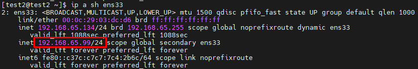

# Mô hình Keepalived làm VIP kết hợp Tomcat


- Tomcat 1: 192.168.65.134 (MASTER)
- Tomcat 2: 192.168.65.130 (BACKUP)
- VIP: 192.168.65.99/24

# Các bước thực hiện

## Bước 1: Cài đặt và cấu hình Tomcat

Cài đặt xem [tại đây](https://github.com/TheTD103/Document_Notes_VIVAS/blob/main/2.%20T%C3%ACm%20hi%E1%BB%83u%20v%E1%BB%81%20TOMCAT/2.Install_Tomcat_CentOS_7.md)

## Bước 2: Cấu hình Keepalived

- Trên node MASTER

```sh
vim /etc/keepalived/keepalived.conf
```
Sửa file cấu hình như sau:

```sh
vrrp_script check_tomcat {
    script "pgrep -x java"
    interval 2
    weight 4
}

vrrp_instance VI_1 {
    state MASTER
    interface ens33
    virtual_router_id 52
    priority 100
    advert_int 1
    authentication {
        auth_type PASS
        auth_pass 1111
    }
    virtual_ipaddress {
        192.168.65.99/24
    }
    track_script {
        check_tomcat
    }
}
```

- Trên node BACKUP

```sh
vrrp_script check_tomcat {
    script "pgrep -x java"
    interval 2
    weight 4
}

vrrp_instance VI_1 {
    state BACKUP
    interface ens33
    virtual_router_id 52
    priority 99
    advert_int 1
    authentication {
        auth_type PASS
        auth_pass 1111
    }
    virtual_ipaddress {
        192.168.65.99/24
    }
    track_script {
        check_tomcat
    }
}
```

Khởi động lại Tomcat và Keepalived

```sh
systemctl restart tomcat
systemctl restart keepalived
```

# Kết quả



Trên node 192.168.65.134 (MASTER) đã nhận địa chỉ VIP trong file cấu hình `keepalived.conf`


Sau khi ta stop tomcat ở node 192.168.65.134 (MASTER) đi và theo dõi logs trả về ta thấy

```sh
tail -f /var/log/messages
```


Có sự thay đổi giữa máy chủ MASTER và BACKUP

