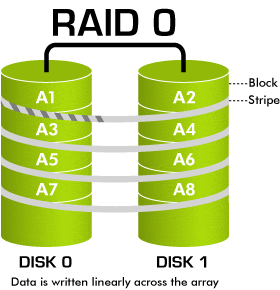
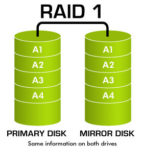
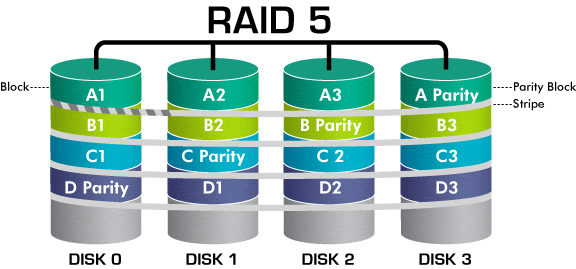
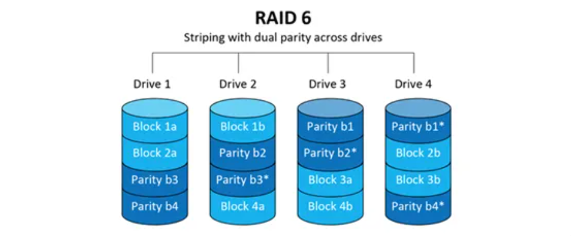
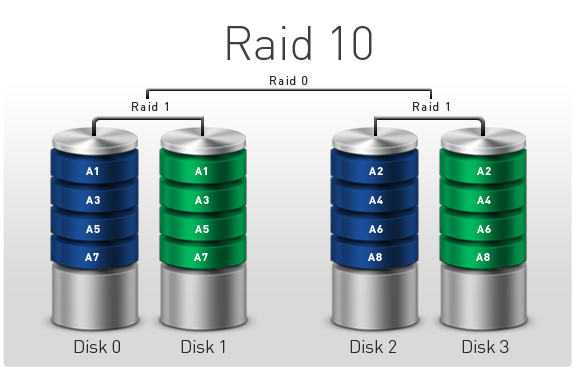
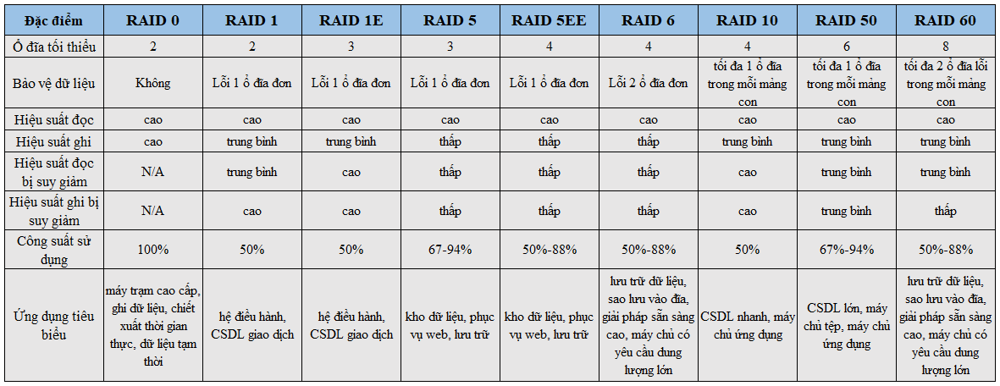

# RAID

# I. Giới thiệu chung

**RAID "Redundant Array of Independent Disks" (Hệ thống mảng ổ cứng độc lập có tính dự phòng)**. Đây là một kỹ thuật kết hợp nhiều ổ cứng vật lý thành một hệ thống lưu trữ đơn nhất, nhằm cải thiện hiệu năng, độ tin cậy và/hoặc dự phòng dữ liệu

- Có 3 lý do chính để áp dụng RAID:
    - Dự phòng
    - Hiệu quả cao
    - Giá thành thấp

- Có 3 hình thức RAID:
    - Software RAID
    - Hardware RAID
    - Host RAID
# II. Software RAID

Software RAID (RAID phần mềm) là một cách triển khai hệ thống RAID bằng phần mềm, tức là không sử dụng phần cứng RAID chuyên dụng như các bộ điều khiển RAID riêng biệt (hardware RAID). Thay vào đó, các tính năng RAID được xử lý bằng phần mềm từ hệ điều hành của máy tính.

Khi sử dụng software RAID, hệ điều hành sẽ quản lý việc tạo, quản lý, và kiểm soát các cấu hình RAID trên các ổ cứng vật lý. Hệ điều hành sẽ phân phối dữ liệu và tính toán các thông tin kiểm soát (chẵn, hoặc parity) để đảm bảo dữ liệu được phân tán và dự phòng theo cấu hình RAID đã chọn.

Ưu điểm của Software RAID bao gồm:

1. Phạm vi hỗ trợ rộng rãi: Software RAID được hỗ trợ bởi hầu hết các hệ điều hành hiện đại, cho phép triển khai RAID trên nhiều nền tảng phần cứng.

2. Chi phí thấp: Vì không cần phần cứng RAID riêng biệt, việc triển khai RAID phần mềm thường có chi phí thấp hơn so với phần cứng RAID.

3. Dễ dàng nâng cấp: Việc thêm hoặc thay thế ổ cứng trong cấu hình RAID phần mềm thường đơn giản và linh hoạt hơn.

Tuy nhiên, cũng có một số hạn chế của Software RAID:

1. Hiệu suất: Trong một số trường hợp, phần cứng RAID có thể cung cấp hiệu suất tốt hơn, đặc biệt khi xử lý các tải công việc lớn.

2. Phụ thuộc vào tài nguyên hệ thống: Software RAID sử dụng tài nguyên xử lý của hệ thống, có thể ảnh hưởng đến hiệu suất tổng thể của máy tính trong khi xử lý các hoạt động RAID.

3. Khả năng mở rộng: Một số cấu hình RAID phần mềm có thể hạn chế khả năng mở rộng, đặc biệt khi cần thêm nhiều ổ cứng mới.

Software RAID phù hợp với môi trường không yêu cầu hiệu suất cao như máy tính cá nhân, máy chủ nhỏ, và các hệ thống lưu trữ dữ liệu nhỏ. Tùy thuộc vào hệ điều hành và tính năng hỗ trợ, bạn có thể tạo và quản lý RAID phần mềm qua giao diện dòng lệnh hoặc giao diện đồ họa. 

# III. Hardware RAID

Hardware RAID (RAID phần cứng) là một cách triển khai hệ thống RAID bằng phần cứng, sử dụng bộ điều khiển RAID riêng biệt (hardware RAID controller) để quản lý các cấu hình RAID trên các ổ cứng vật lý.

Trong một hệ thống Hardware RAID, bộ điều khiển RAID là một phần cứng độc lập, không phụ thuộc vào hệ điều hành. Bộ điều khiển này có nhiệm vụ xử lý toàn bộ quá trình RAID, bao gồm phân phối dữ liệu, tính toán thông tin kiểm soát (parity), quản lý các cấu hình RAID và cung cấp tính năng dự phòng.

Ưu điểm của Hardware RAID bao gồm:

1. Hiệu suất cao: Vì bộ điều khiển RAID chuyên dụng xử lý toàn bộ hoạt động RAID, hiệu suất thường cao hơn so với Software RAID, đặc biệt khi xử lý các tải công việc lớn.

2. Độ tin cậy cao: Bộ điều khiển RAID cung cấp tính năng dự phòng và quản lý RAID độc lập với hệ điều hành, giúp cải thiện độ tin cậy của hệ thống lưu trữ.

3. Khả năng mở rộng: Một số bộ điều khiển RAID cho phép mở rộng dung lượng lưu trữ bằng cách thêm nhiều ổ cứng mới.

4. Giảm tải cho CPU: Vì phần lớn hoạt động RAID được thực hiện bởi bộ điều khiển RAID, nó giúp giảm tải cho CPU của hệ thống.

Tuy nhiên, cũng có một số hạn chế của Hardware RAID:

1. Chi phí cao: Phần cứng RAID chuyên dụng thường có giá thành cao hơn so với việc triển khai Software RAID.

2. Phụ thuộc vào phần cứng: Nếu bộ điều khiển RAID gặp sự cố, nó có thể ảnh hưởng đến khả năng truy cập dữ liệu trong RAID.

3. Hạn chế mở rộng: Một số bộ điều khiển RAID có hạn chế về khả năng mở rộng và thêm ổ cứng mới.

Hardware RAID phù hợp với môi trường đòi hỏi hiệu suất cao và độ tin cậy cao, như các máy chủ doanh nghiệp, trung tâm dữ liệu, và hệ thống lưu trữ lớn. Triển khai Hardware RAID đòi hỏi mua bộ điều khiển RAID chuyên dụng và thường được thực hiện bởi các kỹ thuật viên chuyên nghiệp.

Trong hệ thống RAID, dữ liệu được chia nhỏ và lưu trữ trên các ổ cứng khác nhau, tạo thành một cấu trúc RAID. Có nhiều cấu hình RAID phổ biến, bao gồm:

1. **RAID 0**: Gọi là "Striping". Dữ liệu được chia thành các phần nhỏ và lưu trữ trên các ổ cứng khác nhau. 

    

- **Hiệu suất**: Cải thiện tốc độ đọc/ghi vì dữ liệu được chia nhỏ và phân tán trên nhiều ổ cứng
- **Dự phòng**: Không cung cấp tính năng dự phòng. Nếu một ổ cứng hỏng, dữ liệu toàn bộ RAID có thể bị mất
- **Số ổ cứng tối thiểu**: 2 ổ cứng
- **Đối tượng sử dụng**: Thích hợp với những dịch vụ cần lưu trữ, truy xuất với tốc độ cao. Chẳng hạn như dịch vụ Video streaming, chạy cơ sở dữ liệu,...
 
2. **RAID 1**: Gọi là "Mirroring". Dữ liệu được sao chép đồng thời lên ít nhất 2 ổ cứng

    

- **Hiệu suất**: Không cải thiện hiệu suất đọc/ghi vì dữ liệu được sao chép đồng thời lên các ổ cứng
- **Dự phòng**: Cung cấp tính năng dự phòng cao. Dữ liệu vẫn an toàn khi một ổ cứng hỏng
- **Số ổ cứng tối thiểu**: 2 ổ cứng
- **Đối tượng sử dụng**: Các dịch vụ lưu trữ, các website vừa và nhỏ không yêu cầu quá cao về tốc độ ghi (in/out) của ổ cứng. Các đối tượng yêu cầu sự an toàn về dữ liệu như các dịch vụ kế toán, lưu trữ thông tin khách hàng, bất động sản,...

3. **RAID 5**: Cũng là một loại RAID được phổ biến rộng rãi. Nguyên tắc cơ bản của RAID 6 cũng gần giống với 2 loại RAID 1 và RAID 0, kết hợp cả tính dự phòng và hiệu suất. Dữ liệu được chia thành các khối nhỏ và phân tán trên các ổ cứng

- __Hiệu suất__: Cải thiện tốc độ đọc/ghi tốt hơn RAID 1, vì dữ liệu được chia thành các khối và phân tán trên nhiều ổ cứng.
- __Dự phòng__: Cung cấp tính dự phòng bằng cách sử dụng parity. Dữ liệu vẫn an toàn khi một ổ cứng hỏng
- __Số ổ cứng tối thiểu__: Ba ổ cứng
- **Đối tượng sử dụng**: Tất cả những website, dịch vụ, ứng dụng có số lượng truy cập và yêu cầu tài nguyên từ nhỏ đến vừa và lớn

4. **RAID 6**: Tương tự như RAID 5 nhưng lưu thêm một ổ cứng parity

- __Hiệu suất__: Tương tự như RAID 5, tuy nhiên đôi khi hiệu ứng hiệu suất ghi chậm hơn do việc tính toán hai ổ parity
- __Dự phòng__: Cung cấp tính dự phòng cao hơn RAID 5, có thể phục hồi dữ liệu khi đến hai ổ cứng hỏng
- __Sổ ổ cứng tối thiểu__: Bốn ổ cứng

5. **RAID 10 (Hoặc 1+0)**: Kết hợp giữa RAID 1 và RAID 0. Dữ liệu được sao chép (mirroring) trước khi chia thành các khối và lưu trữ trên các ổ cứng khác nhau.

    

- **Hiệu suất**: Cung cấp tốc độ đọc/ghi cao nhờ kết hợp giữa RAID 1 và RAID 0
- **Dự phòng**: Cung cấp tính dự phòng cao, có thể phục hồi dữ liệu khi một hoặc nhiều ổ cứng hỏng tùy thuộc cào vị trí của ổ cứng hỏng
- **Số ổ cứng tối thiểu**: 4 ổ cứng
- **Đối tượng sử dụng**: Thích hợp với tất cả các đối tượng (Từ yêu cầu về hiệu suất đến việc đảm bảo an toàn dữ liệu)

**Bảng so sánh một số loại RAID**

