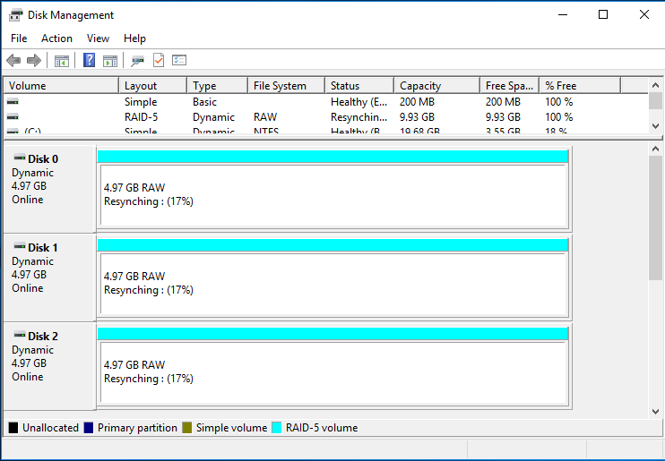

# I. Thiết lập RAID 0, 1, 5 trên Window Server 2016 standard

- Chuẩn bị 3 ổ cứng trên VMwware: ***Setting -> Add -> Hard disk***


- Mở thiết lập **Disk Management**, bật online tất cả các ổ cứng


- Chọn 1 ổ trống, click chuột phải sau đó chọn loại RAID muốn tạo:

1. New Simple Volume (Ổ đơn giản mới):
   - Tùy chọn này cho phép bạn tạo một ổ đĩa ảo mới trên một ổ cứng vật lý có sẵn hoặc một không gian không được phân vùng.
   - Ổ đơn giản mới có thể sử dụng như một ổ đĩa độc lập hoặc định dạng và gán một chữ cái ổ đĩa để sử dụng.

2. New Spanned Volume (Ổ gộp mới):
   - Tùy chọn này cho phép bạn kết hợp các ổ cứng vật lý thành một ổ đĩa ảo lớn hơn.
   - Dữ liệu sẽ lưu trữ tuần tự trên các ổ cứng kết hợp này, tạo thành một không gian lưu trữ liên tục. Nếu một ổ cứng bị hỏng, dữ liệu từ các ổ cứng khác vẫn sẽ được truy xuất.
   - Tuy nhiên, nếu một ổ cứng bị hỏng, toàn bộ dữ liệu của các ổ cứng kết hợp sẽ bị mất.

3. New Striped Volume (Ổ đĩa ghi sọc mới):
   - Tùy chọn này cho phép bạn kết hợp các ổ cứng vật lý thành một ổ đĩa ảo lớn hơn.
   - Dữ liệu được phân chia thành các "stripe" và tuần tự ghi vào các ổ cứng kết hợp này, tăng tốc độ ghi dữ liệu.
   - Tuy nhiên, như New Spanned Volume, nếu một ổ cứng bị hỏng, toàn bộ dữ liệu của các ổ cứng kết hợp sẽ bị mất.

4. New Mirrored Volume (Ổ gương mới):
   - Tùy chọn này cho phép bạn tạo một cấu hình RAID 1 (gương) bằng cách kết hợp hai ổ cứng vật lý.

5. New RAID-5 Volume (Ổ RAID-5 mới):
   - Tùy chọn này cho phép bạn tạo một cấu hình RAID 5 bằng cách kết hợp ba hoặc nhiều ổ cứng vật lý.


Ví dụ đây tôi tạo RAID 5


Vì RAID 5 cần tối thiểu 3 ổ cứng nên chọn thêm 2 ổ cứng 





Đây là các bước thiết lập RAID trên WIndows

# I. Thiết lập RAID 1 trên Centos 7

## Bước 1: Cập nhật hệ thống và cài đặt mdadm để quản lý RAID

```sh
yum update
yum install mdadm
```
## Bước 2: Kiểm tra thông tin ổ đĩa trên máy
- Kiểm tra ổ đĩa trước khi tạo RAID 1, có ít nhất 2 ổ đĩa:
```sh
fdisk -l | grep sd
```

```sh
[root@test1 ~]# fdisk -l | grep sd
Disk /dev/sda: 10.7 GB, 10737418240 bytes, 20971520 sectors
/dev/sda1   *        2048     2099199     1048576   83  Linux
/dev/sda2         2099200    20971519     9436160   8e  Linux LVM
Disk /dev/sdb: 1073 MB, 1073741824 bytes, 2097152 sectors
Disk /dev/sdc: 1073 MB, 1073741824 bytes, 2097152 sectors
```

- Ta thấy có 2 đĩa cứng mới. Thực hiện kiểm tra xem ổ cứng có sử dụng RAID nào chưa bằng lệnh:

```sh
mdadm -E /dev/sd[b-c]
```

```sh
[root@test1 ~]# mdadm -E /dev/sd[b-c]
mdadm: No md superblock detected on /dev/sdb.
mdadm: No md superblock detected on /dev/sdc.
```
Không thấy khối nào

## Bước 3: Tạo phân vùng đĩa cứng. Tạo phân vùng đĩa sdb và sdc cho RAID

**Tạo phân vùng trên ổ đĩa sdb**

- Chạy lệnh `fdisk /dev/sdb` để tạo phân vùng cho sbd và thực hiện các thao tác sau:
    - Nhấn **n** để tạo phân vùng mới
    - Sau đó nhấn **p** cho phân vùng chính
    - Tiếp thoe chọn số phân vùng là 1
    - Nhập giá trị ban đầu, giá trị kết thúc và nhấn **Enter**
    - Tiếp theo nhấn **p** để in phân vùng đã được tạo 
    

- Thực hiện các bước sau để tạo Linux RAID tự động trên các phân vùng
    - Nhấn **l** để liệt kê tất cả các phân vùng có sẵn
    - Nhập **t** để chọn phân vùng 
    - Nhập **fd** để chọn Linux RAID tự động và nhấn Enter để áp dụng
    - Sử dụng phím **p** để in những thay đổi
    - Cuối cùng nhấn phím **w** để lưu các thay đổi
    
    

**Tương tự thực hiện tạo phân vùng trên sdc**

# Tài liệu tham khảo

1. https://github.com/ductai124/Thuc-Tap-ViettelCo-Sunclound-/tree/main/RAID#1-thi%E1%BA%BFt-l%E1%BA%ADp-raid-1-tr%C3%AAn-centos7


