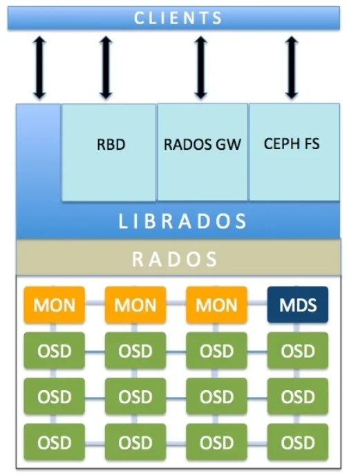
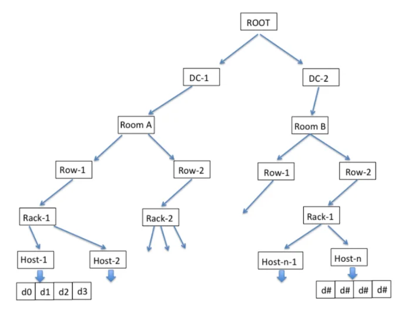

# Tìm hiểu về CEPH Storage

## 1. Giới thiệu chung

Ceph storage là một hệ thống lưu trữ phân tán mã nguồn mở được thiết kế cung cấp khả năng lưu trữ và quản lý dữ liệu trong môi trường phân tán, đa nguồn và đa dạng. Nó sử dụng kiến trúc phân tán để lưu trữ dữ liệu trên nhiều máy tính và cung cấp khả năng tự phục hồi, độ tin cậy cao và hiệu suất tốt

**Ceph storage được sử dụng để**

- **Lưu trữ dữ liệu**: Ceph cho phép bạn lưu trữ dữ liệu của bạn theo nhiều cách khác nhau, bao gồm lưu trữ dưới dạng khối (RBD), lưu trữ đối tượng (RGW) và hệ thống tập tin (Ceph FS). 
- **Mở rộng linh hoạt**: Ceph cho phép bạn thêm nút lưu trữ mới để mở rộng dung lượng lưu trữ và hiệu suất mà không làm gián đoạn hoạt động của hệ thống. Điều này rất hữu ích khi bạn mở rộng hệ thống lưu trữ để đáp ứng nhu cầu tăng trưởng dữ liệu
- **Tích hợp trong môi trường ảo hóa và đám mây**: Ceph có thể tích hợp tốt với các môi trường ảo hóa như VMware, KVM và các nền tảng đám mây như Openstack. Điều này giúp cung cấp lưu trữ hiệu suất cao cho các máy chủ ảo và ứng dụng trong môi trường ảo hóa
- __Đảm bảo độ tin cậy và tính sẵn sàng__: Ceph sử dụng kỹ thuật sao lưu và phục hồi để đảm bảo dữ liệu của bạn luôn an toàn và có sẵn. Nó có khả năng tự phục hồi khi có sự cố xảy ra, giúp đảm bảo tính sẵn sàng của hệ thống 
- **Lưu trữ đối tượng và dịch vụ trực tuyến**: Ceph Object Gateway cho phép bạn triển khai dịch vụ lưu trữ đối tượng như Amazon S3 và Openstack Swift.

## 2. Kiến trúc Ceph

Kiến trúc của Ceph được chia thành 3 tầng chính: Ceph Storage Cluster, Librados và interface

### Ceph Storage Cluster

Đây là phần chính của Ceph, nó hoạt động như một hệ thống lưu trữ phân tán. Nó bao gồm các thành phần như RADOS (Reliable Autonomic Distributed Object Store) để lưu trữ dữ liệu theo hình thức đối tượng phân tán, Ceph OSD để quản lý dữ liệu trên các thiết bị lưu trữ thực tế, Ceph Monitors để giám sát trạng thái của cụm và Ceph Metedata Server để quản lý metadata cho hệ thống tệp

- __OSD (Object Storage Daemon)__ là các tiến trình quản lý các thiết bị lưu trữ trong hệ thống Ceph. Thông thường một OSD process sẽ quản lý một thiết bị lưu trữ vật lý (1 physical disk hoặc 1 volume trong storage device được exposed cho host). OSD trực tiếp thực hiện các tác vụ đọc ghi dữ liệu, tạo các replicas, tải cân bằng, khôi phục dữ liệu. OSD sẽ giao tiếp với OSD khác và cung cấp thông tin cho các tiến trình MON và MRG. Trong hệ thống Ceph cần tối thiểu 3 OSD để đảm bảo tính sẵn sàng và an toàn dữ liệu

- **MON (Monitor Daemon)** là các tiến trình quan trọng trong việc thực hiện các hoạt động của RADOS. MON lưu trữ toàn bộ các thông tin để có thể truy cập đến đúng dữ liệu theo yêu cầu. MON lưu trữ các Cluster Map, bao gồm các loại map sau:
    - **Monitor Map**: Lưu thông tin node trong cluster, địa chỉ, port của tiến trình monitor. Map này lưu thông tin khi khởi tạo và các thay đổi
    - **OSD Map**: lưu danh sách pool, replica size, số lượng PG, danh sách các OSD cùng trạng thái. OSD Map lưu khi khởi tạo và các trạng thái thay đổi
    - **PG Map**: PG version và timestamp, OSD map hiện tại, full ratio (tỷ lệ sử dụng của các OSD) và chi tiết của các PG như PG ID, trạng thái, số liệu thống kê hoạt động của pool trong PG
    - **CRUSH Map**: Lưu cấu trúc của các thiết bị lưu trữ (device, host, rack, row, room) và các quy tắc để thực hiện thao tác dữ liệu trên cấu trúc các thiết bị lưu trữ. Cẹp sử dụng CRUSH Map để nhận biết trạng thái của các thành phần trong cluster để đảm bảo nhân bản dữ liệu khi có các thành phần trong hệ thống lỗi

    

### Librados

Đây là một thư viện viết bằng ngôn ngữ C, cho phép client giao tiếp trực tiếp với RADOS. Tất cả các truy cập đến RADOS đều thông qua thư việc librados, gồm cả tầng interface hoặc các ứng dụng khác không sử dụng interface sẵn có của Ceph. Thư viện này hỗ trợ nhiều ngôn ngữ lập trình phổ biến C++, java, php,...

### Interface

- **RBD (Rados Block Device)** cung cấp dịch vụ lưu trữ dưới dạng các thiết bị block. Đây là hình thức lưu trữ cơ bản khi dữ liệu được chi vào các block (512 bytes). Các thiết bị lưu trữ vật lý như HĐ, SSD cũng thường lưu trữ Data dạng thô theo hình thức này. RDG dựa trên nền tảng lưu trữ đối tượng của Ceph Storage Cluster để cung cấp các block device cho các client

    - Mỗi Block Device có thể lưu trữ trên một hoặc nhiều object của tầng Ceph Storage Cluster. Sử dụng các tính năng thừa hưởng từ RADOS, các block device có khả năng resizeble, thin-provision, clone, snapshot
    - Về phía client, Ceph hỗ trợ ánh xạ các block device vào các kernel object đối với các hệ thống Linux hoặc sử dụng librdc cho các hệ thống QEMU/KVM
    
     

# Tài liệu tham khảo

1. https://sdsrv.ai/blog/gioi-thieu-ve-ceph-giai-phap-luu-tru-tren-cloud/
2. https://blog.devopsviet.com/category/ceph/