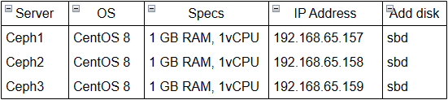
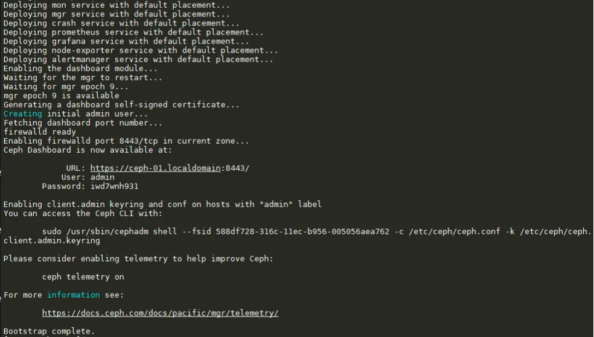
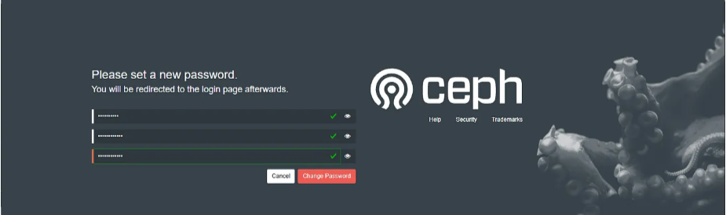
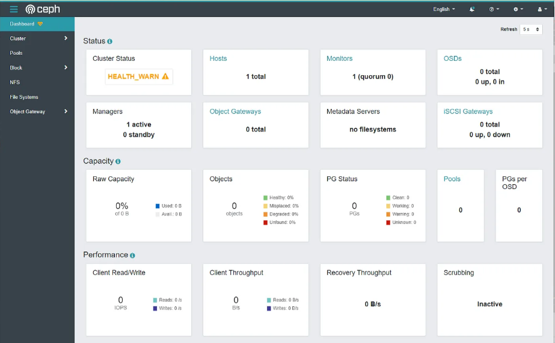
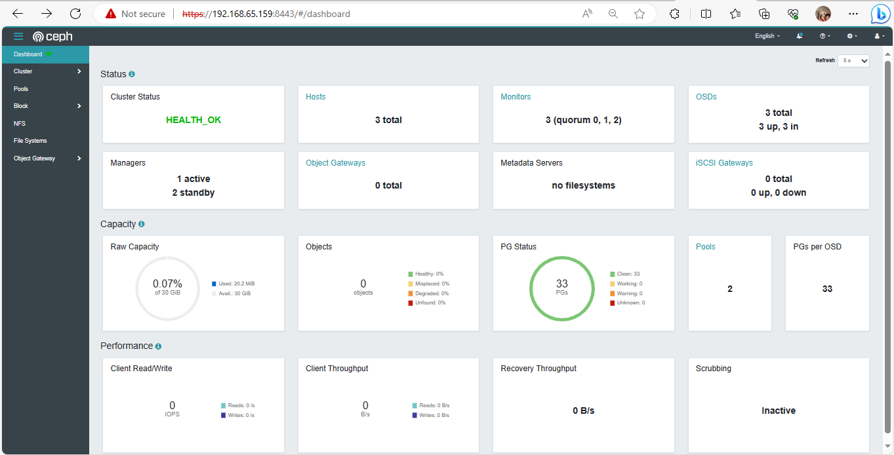
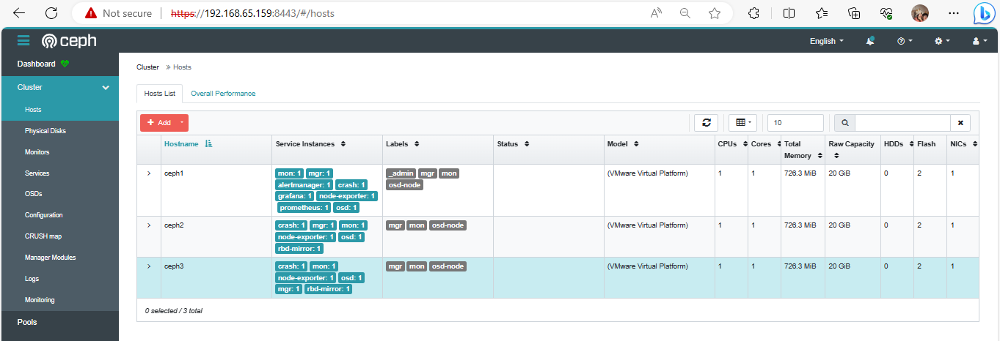

# Cài đặt Ceph Pacific bằng cephadm trên Cent OS 8

Mô hình



## Thiết lập cụm Ceph

**Các bước thực hiện**

1. Login bằng root và thêm các host vào `/etc/hosts`

```sh
$ sudo tee -a /etc/hosts<<EOF
192.168.65.157  ceph1   ceph1.localdomain
192.168.65.158  ceph2   ceph2.localdomain
192.168.65.159  ceph3   ceph3.localdomain
EOF
```

2. Thiết lập `ssh-keygen`

```sh
ssh-keygen
ssh-copy-id ceph1
ssh-copy-id ceph2
ssh-copy-id ceph3

dnf update -y; dnf upgrade -y
```
3. Cài đặt python3, lvm2 và podman

```sh
dnf install -y python3 lvm2 podman
```

4. Tải xuống tệp lệnh Ceph

```sh
curl --silent --remote-name --location https://github.com/ceph/ceph/raw/pacific/src/cephadm/cephadm
```

Cấp quyền thực thi chop cephadm

```sh
chmod +x cephadm
```

Cài đặt các gói cung cấp cephadm

```sh
./cephadm add-repo --release pacific
./cephadm install
```
Cài đặt Ceph-common

```sh
dnf install -y ceph-common
which cephadm
```
5. Bootstrap cụm Ceph mới

```sh
cephadm bootstrap --mon-ip 192.168.65.157
```



Kiểm tra Ceph Dashboard, truy cập địa chỉ IP của ceph-01 https://192.168.65.157:8443/ và sử dụng thông tin xác thực từ đầu ra cephadm bootstrap sau đó đặt mật khẩu mới





Xác minh Ceph và kiểm tra trạng thái của Ceph

```sh
[root@ceph1 ~]# ceph -v
ceph version 16.2.13 (5378749ba6be3a0868b51803968ee9cde4833a3e) pacific (stable)
```
```sh
[root@ceph1 ~]# ceph -s
cluster:
    id:     588df728-316c-11ec-b956-005056aea762
    health: HEALTH_WARN
            OSD count 0 < osd_pool_default_size 3
services:
    mon: 1 daemons, quorum ceph-01 (age 14m)
    mgr: ceph-01.wgdjcn(active, since 12m)
    osd: 0 osds: 0 up, 0 in
data:
    pools:   0 pools, 0 pgs
    objects: 0 objects, 0 B
    usage:   0 B used, 0 B / 0 B avail
    pgs:
```

Xác minh các containers đang chạy cho từng dịch vụ và kiểm tra trạng thái dịch vụ systemd cho từng containers

```sh
[root@ceph1 ~]# podman ps
CONTAINER ID  IMAGE                                                                                      COMMAND               CREATED         STATUS         PORTS       NAMES
b0c2ddb49063  quay.io/prometheus/node-exporter:v1.3.1                                                    --no-collector.ti...  36 minutes ago  Up 36 minutes              ceph-248a2fbc-4643-11ee-bb3c-000c29d332bb-node-exporter-ceph1
a3fd5c9b4822  quay.io/ceph/ceph@sha256:4e83fcd241a8099ae2d24de0e1f859962cf65f577d945765fb0cf394dc35635d  -n client.crash.c...  36 minutes ago  Up 36 minutes              ceph-248a2fbc-4643-11ee-bb3c-000c29d332bb-crash-ceph1
566eab3c594a  quay.io/ceph/ceph-grafana:8.3.5                                                            /bin/bash             36 minutes ago  Up 36 minutes              ceph-248a2fbc-4643-11ee-bb3c-000c29d332bb-grafana-ceph1
0b51a580b387  quay.io/prometheus/alertmanager:v0.23.0                                                    --cluster.listen-...  36 minutes ago  Up 36 minutes              ceph-248a2fbc-4643-11ee-bb3c-000c29d332bb-alertmanager-ceph1
b02cf1acae49  quay.io/prometheus/prometheus:v2.33.4                                                      --config.file=/et...  36 minutes ago  Up 36 minutes              ceph-248a2fbc-4643-11ee-bb3c-000c29d332bb-prometheus-ceph1
f8cfa44e45b7  quay.io/ceph/ceph:v16                                                                      -n mgr.ceph1.sbof...  36 minutes ago  Up 36 minutes              ceph-248a2fbc-4643-11ee-bb3c-000c29d332bb-mgr-ceph1-sbofdc
7de135b5a9b1  quay.io/ceph/ceph:v16                                                                      -n mon.ceph1 -f -...  36 minutes ago  Up 36 minutes              ceph-248a2fbc-4643-11ee-bb3c-000c29d332bb-mon-ceph1
8c7006ad1c29  quay.io/ceph/ceph@sha256:4e83fcd241a8099ae2d24de0e1f859962cf65f577d945765fb0cf394dc35635d  -n osd.2 -f --set...  36 minutes ago  Up 36 minutes              ceph-248a2fbc-4643-11ee-bb3c-000c29d332bb-osd-2
```

```sh
[root@ceph1 ~]# systemctl status ceph-* --no-pager
```

6. Thêm máy chủ vào cụm

Cài đặt khóa SSH công khai của máy chủ hiện tại vào tài khoản root của máy chủ mới:

```sh
[root@ceph1 ~]# ssh-copy-id -f -i /etc/ceph/ceph.pub root@ceph2
[root@ceph1 ~]# ssh-copy-id -f -i /etc/ceph/ceph.pub root@ceph3
```

Thông báo cho Ceph biết rằng một máy chủ mới đã là một phần của cụm và nó kết nối máy chủ với địa chỉ IP tương ứng. 

```sh
[root@ceph1 ~]# ceph orch host add ceph2 192.168.65.158
Added host 'ceph2' with addr '192.168.65.158'
[root@ceph1 ~]# ceph orch host add ceph3 192.168.65.159
Added host 'ceph3' with addr '192.168.65.159'
[root@ceph1 ~]# ceph orch host ls
HOST   ADDR            LABELS                   STATUS
ceph1  192.168.65.157  _admin 
ceph2  192.168.65.158  
ceph3  192.168.65.159  
3 hosts in cluster
```
7. Deploy OSDs vào cụm

Hiển thị danh sách các storage trên các host

```sh
[root@ceph1 ~]# ceph orch device ls
HOST   PATH          TYPE  DEVICE ID                                   SIZE  AVAILABLE  REFRESHED  REJECT REASONS
ceph1  /dev/nvme0n2  ssd   VMware Virtual NVMe Disk_VMware NVME_0000  10.7G             24m ago    Insufficient space (<10 extents) on vgs, LVM detected, locked
ceph2  /dev/nvme0n2  ssd   VMware Virtual NVMe Disk_VMware NVME_0000  10.7G             24m ago    Insufficient space (<10 extents) on vgs, LVM detected, locked
ceph3  /dev/nvme0n2  ssd   VMware Virtual NVMe Disk_VMware NVME_0000  10.7G             24m ago    Insufficient space (<10 extents) on vgs, LVM detected, locked

```

Yêu cầu Ceph sử dụng toàn bộ Storage sẵn có và chưa sử dụng 

```sh
ceph orch apply osd --all-available-devices
```
Tạo OSD từ một thiết bị cụ thể trên một máy chủ cụ thể

```sh
ceph orch daemon add osd *<host>*:*<device-path>*
```

```sh
[root@ceph1 ~]# ceph orch apply osd --all-available-devices
Scheduled osd.all-available-devices update...
[root@ceph1 ~]# ceph -s
  cluster:
    id:     248a2fbc-4643-11ee-bb3c-000c29d332bb
    health: HEALTH_OK

  services:
    mon:        3 daemons, quorum ceph1,ceph2,ceph3 (age 60m)
    mgr:        ceph3.voyipe(active, since 60m), standbys: ceph1.sbofdc, ceph2.fysueg
    osd:        3 osds: 3 up (since 60m), 3 in (since 5d)
    rbd-mirror: 2 daemons active (2 hosts)

  data:
    pools:   2 pools, 33 pgs
    objects: 0 objects, 0 B
    usage:   20 MiB used, 30 GiB / 30 GiB avail
    pgs:     33 active+clean
[root@ceph1 ~]# ceph osd tree
ID  CLASS  WEIGHT   TYPE NAME       STATUS  REWEIGHT  PRI-AFF
-1         0.02939  root default
-5         0.00980      host ceph1
 2    ssd  0.00980          osd.2       up   1.00000  1.00000
-7         0.00980      host ceph2
 1    ssd  0.00980          osd.1       up   1.00000  1.00000
-3         0.00980      host ceph3
 0    ssd  0.00980          osd.0       up   1.00000  1.00000
```

8. Deploy ceph-mon

```sh
[root@ceph1 ~]# ceph orch apply mon --placement="ceph1,ceph2,ceph3"
Scheduled mon update...
[root@ceph1 ~]# ceph orch ps | grep mon
mon.ceph1       ceph1       running (63m)    50s ago   6d     113M    2048M  16.2.13  9e29efbb67d5  7de135b5a9b1
mon.ceph2       ceph2       running (68m)    53s ago   6d     171M    2048M  16.2.13  9e29efbb67d5  787e488392ce
mon.ceph3       ceph3       running (68m)    53s ago   6d     120M    2048M  16.2.13  9e29efbb67d5  7bdc94849b6f
```
9. Deploy ceph-mgr
```sh
[root@ceph1 ~]# ceph orch apply mgr --placement="ceph1,ceph2,ceph3"
Scheduled mgr update...
[root@ceph1 ~]# ceph orch ps | grep mgr
mgr.ceph1.sbofdc    ceph1  *:9283       running (66m)     3m ago   6d    20.1M      -  16.2.13  9e29efbb67d5  f8cfa44e45b7
mgr.ceph2.fysueg    ceph2  *:8443,9283  running (70m)     3m ago   6d    24.0M      -  16.2.13  9e29efbb67d5  400732a5da01
mgr.ceph3.voyipe    ceph3  *:8443,9283  running (70m)     3m ago   6d     142M      -  16.2.13  9e29efbb67d5  1ce604a86d3c
```

10. Đặt nhãn dán trên các node
```sh
Set label osd-node on all node
[root@ceph1 ~]# ceph orch host label add ceph1 osd-node
[root@ceph1 ~]# ceph orch host label add ceph2 osd-node
[root@ceph1 ~]# ceph orch host label add ceph3 osd-node
Set label mon on all node
[root@ceph1 ~]# ceph orch host label add ceph1 mon
[root@ceph1 ~]# ceph orch host label add ceph2 mon
[root@ceph1 ~]# ceph orch host label add ceph3 mon
Set label mgr on all node
[root@ceph1 ~]# ceph orch host label add ceph1 mgr
[root@ceph1 ~]# ceph orch host label add ceph2 mgr
[root@ceph1 ~]# ceph orch host label add ceph3 mgr
```

## Hoàn thành

```sh
[root@ceph1 ~]# ceph orch ps
NAME                     HOST   PORTS        STATUS         REFRESHED  AGE  MEM USE  MEM LIM  VERSION  IMAGE ID      CONTAINER ID
alertmanager.ceph1       ceph1  *:9093,9094  running (69m)     6m ago   6d    29.5M        -  0.23.0   ba2b418f427c  0b51a580b387
crash.ceph1              ceph1               running (69m)     6m ago   6d    4064k        -  16.2.13  9e29efbb67d5  a3fd5c9b4822
crash.ceph2              ceph2               running (74m)     6m ago   6d    3611k        -  16.2.13  9e29efbb67d5  f9d5aafc53ea
crash.ceph3              ceph3               running (74m)     6m ago   6d     679k        -  16.2.13  9e29efbb67d5  331447f0a50f
grafana.ceph1            ceph1  *:3000       running (69m)     6m ago   6d    64.4M        -  8.3.5    dad864ee21e9  566eab3c594a
mgr.ceph1.sbofdc         ceph1  *:9283       running (69m)     6m ago   6d    20.1M        -  16.2.13  9e29efbb67d5  f8cfa44e45b7
mgr.ceph2.fysueg         ceph2  *:8443,9283  running (74m)     6m ago   6d    24.0M        -  16.2.13  9e29efbb67d5  400732a5da01
mgr.ceph3.voyipe         ceph3  *:8443,9283  running (74m)     6m ago   6d     142M        -  16.2.13  9e29efbb67d5  1ce604a86d3c
mon.ceph1                ceph1               running (69m)     6m ago   6d     113M    2048M  16.2.13  9e29efbb67d5  7de135b5a9b1
mon.ceph2                ceph2               running (74m)     6m ago   6d     171M    2048M  16.2.13  9e29efbb67d5  787e488392ce
mon.ceph3                ceph3               running (74m)     6m ago   6d     120M    2048M  16.2.13  9e29efbb67d5  7bdc94849b6f
node-exporter.ceph1      ceph1  *:9100       running (69m)     6m ago   6d    14.9M        -  1.3.1    1dbe0e931976  b0c2ddb49063
node-exporter.ceph2      ceph2  *:9100       running (74m)     6m ago   6d    17.5M        -  1.3.1    1dbe0e931976  16bf2e14659a
node-exporter.ceph3      ceph3  *:9100       running (74m)     6m ago   6d    19.1M        -  1.3.1    1dbe0e931976  39e871b74edb
osd.0                    ceph3               running (74m)     6m ago   6d    26.0M    4096M  16.2.13  9e29efbb67d5  f1013ed3a452
osd.1                    ceph2               running (74m)     6m ago   6d    23.3M    4096M  16.2.13  9e29efbb67d5  d56da9282adf
osd.2                    ceph1               running (69m)     6m ago   6d    20.0M    4096M  16.2.13  9e29efbb67d5  8c7006ad1c29
prometheus.ceph1         ceph1  *:9095       running (69m)     6m ago   6d    80.4M        -  2.33.4   514e6a882f6e  b02cf1acae49
rbd-mirror.ceph2.dxtbzl  ceph2               running (74m)     6m ago   6d    10.4M        -  16.2.13  9e29efbb67d5  2adfde601e92
rbd-mirror.ceph3.kvojkk  ceph3               running (74m)     6m ago   6d    15.4M        -  16.2.13  9e29efbb67d5  55e982020f18
[root@ceph1 ~]# ceph -s
  cluster:
    id:     248a2fbc-4643-11ee-bb3c-000c29d332bb
    health: HEALTH_OK

  services:
    mon:        3 daemons, quorum ceph1,ceph2,ceph3 (age 72m)
    mgr:        ceph3.voyipe(active, since 72m), standbys: ceph1.sbofdc, ceph2.fysueg
    osd:        3 osds: 3 up (since 72m), 3 in (since 5d)
    rbd-mirror: 2 daemons active (2 hosts)

  data:
    pools:   2 pools, 33 pgs
    objects: 0 objects, 0 B
    usage:   20 MiB used, 30 GiB / 30 GiB avail
    pgs:     33 active+clean
[root@ceph1 ~]# ceph orch host ls
HOST   ADDR            LABELS                   STATUS
ceph1  192.168.65.157  _admin osd-node mon mgr
ceph2  192.168.65.158  osd-node mon mgr
ceph3  192.168.65.159  osd-node mon mgr
3 hosts in cluster
```




## Tài liệu tham khảo

1. https://docs.ceph.com/en/latest/cephadm/
2. https://achchusnulchikam.medium.com/deploy-ceph-cluster-with-cephadm-on-centos-8-257b300e7b42
